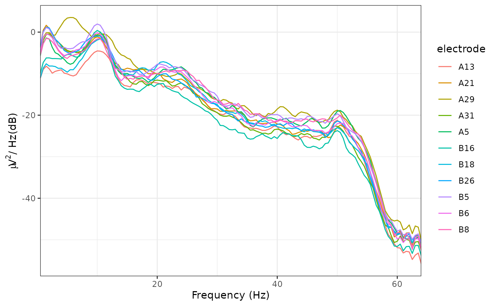
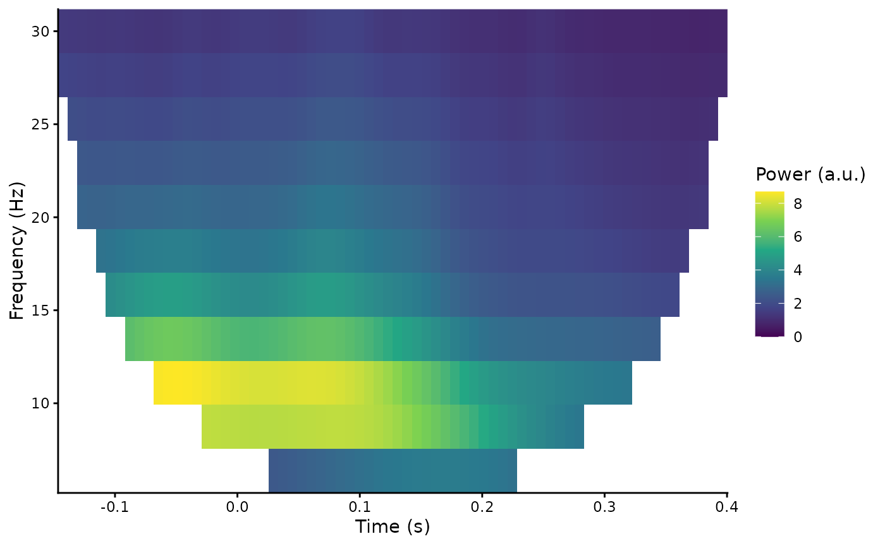
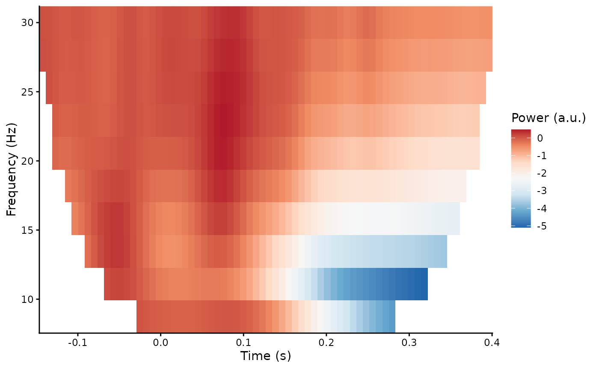
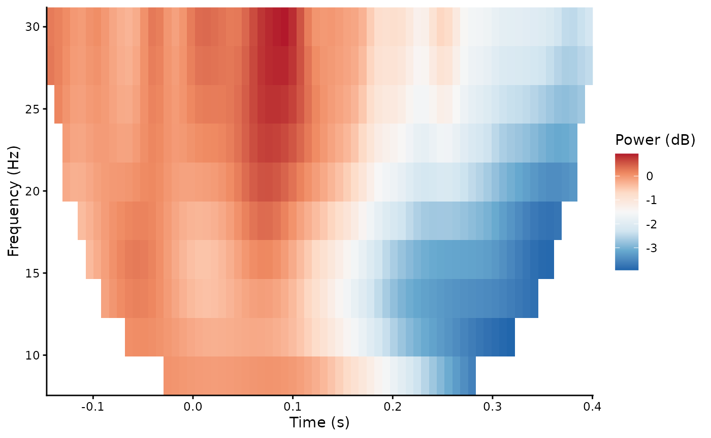

# Frequency analysis

Periodicity is commonly observed in EEG signals. For example,
oscillations in the alpha frequency range (approximately 8-13 Hz) were
one of the first signals observed in the human EEG. One method of
analysing this periodicity is to calculate the Power Spectral Density
using a method such as Welch’s FFT.

## Frequency analysis

In `eegUtils`, this can be achieved using
[`compute_psd()`](https://craddm.github.io/eegUtils/reference/compute_psd.md)
and
[`plot_psd()`](https://craddm.github.io/eegUtils/reference/plot_psd.md).
With epoched data,
[`compute_psd()`](https://craddm.github.io/eegUtils/reference/compute_psd.md)
calculates the PSD for each trial separately.
[`compute_psd()`](https://craddm.github.io/eegUtils/reference/compute_psd.md)
returns a `data.frame` with spectral power at each resolved frequency
and for each electrode. Note that
[`plot_psd()`](https://craddm.github.io/eegUtils/reference/plot_psd.md)
can be called directly on `eeg_data` or `eeg_epochs` objects without
first having to
[`compute_psd()`](https://craddm.github.io/eegUtils/reference/compute_psd.md).
With epoched data, it will compute the PSD for each epoch and then
average over epochs before plotting.

``` r
library(eegUtils)
#> 
#> Attaching package: 'eegUtils'
#> The following object is masked from 'package:stats':
#> 
#>     filter
demo_psd <- compute_psd(demo_epochs)
#> Removing channel means per epoch...
#> Computing Power Spectral Density using Welch's method.
#> FFT length: 256
#> Segment length: 84
#> Overlapping points: 42 (50% overlap)
plot_psd(demo_epochs)
#> Removing channel means per epoch...
#> Computing Power Spectral Density using Welch's method.
#> FFT length: 256
#> Segment length: 84
#> Overlapping points: 42 (50% overlap)
```



## Time-frequency analysis

Frequency analysis necessarily discards temporal information. One
problem is that it assumes stationarity - that the signal remains stable
in terms of frequency and power across the whole analysed time window.
However, this is rarely the case with EEG data, which exhibits dynamics
across a wide range of timescales.

Time-frequency analysis is a method of accounting for non-stationarity
by decomposing the signal using a moving-window analysis, tiling the
time-frequency space to resolve power over relatively shorter
time-windows.

In `eegUtils`,
[`compute_tfr()`](https://craddm.github.io/eegUtils/reference/compute_tfr.md)
can be used to calculate a time-frequency representation of
[`eeg_epochs()`](https://craddm.github.io/eegUtils/reference/eeg_epochs.md).
Currently, this is achieved using Morlet wavelets. Morlet wavelets are
used to window the signal, controlling spectral leakage and
time-frequency specificity. Morlet wavelets have a user-defined temporal
extent, which in turn determines the frequency extent. We define the
temporal extent of our wavelets by **cycles**; we define it as an
integer number of cycles at each frequency of interest.

``` r
demo_tfr <- compute_tfr(demo_epochs,
                        method = "morlet",
                        foi = c(4, 30),
                        n_freq = 12,
                        n_cycles = 3)
#> Computing TFR using Morlet wavelet convolution
#> Output frequencies using linear spacing: 4 6.36 8.73 11.09 13.45 15.82 18.18 20.55 22.91 25.27 27.64 30
#> Removing channel means per epoch...
#> Returning signal averaged over all trials.
demo_tfr
#> Epoched EEG TFR data
#> 
#> Frequency range      :    4 6.36 8.73 11.09 13.45 15.82 18.18 20.55 22.91 25.27 27.64 30 
#> Number of channels   :    11 
#> Electrode names      :    A5 A13 A21 A29 A31 B5 B6 B8 B16 B18 B26 
#> Number of epochs :    1 
#> Epoch limits     :    -0.197 - 0.451 seconds
#> Sampling rate        :    128  Hz
```

Note that the characteristics of the wavelets, in terms of temporal and
frequency standard deviations, are stored inside the `eeg_tfr` object:

``` r
demo_tfr$freq_info$morlet_resolution
#>    frequency   sigma_f    sigma_t n_cycles
#> 1   4.000000  1.333333 0.11936621        3
#> 2   6.363636  2.121212 0.07503019        3
#> 3   8.727273  2.909091 0.05470951        3
#> 4  11.090909  3.696970 0.04305011        3
#> 5  13.454545  4.484848 0.03548725        3
#> 6  15.818182  5.272727 0.03018456        3
#> 7  18.181818  6.060606 0.02626057        3
#> 8  20.545455  6.848485 0.02323944        3
#> 9  22.909091  7.636364 0.02084172        3
#> 10 25.272727  8.424242 0.01889249        3
#> 11 27.636364  9.212121 0.01727669        3
#> 12 30.000000 10.000000 0.01591549        3
```

The results of the time-frequency transformation can be plotted using
the
[`plot_tfr()`](https://craddm.github.io/eegUtils/reference/plot_tfr.md)
function.

``` r
plot_tfr(demo_tfr)
```



Baseline correction is common in the literature, which can serve two
purposes. Several different methods are possible. both for plotting
only, and as a modification to the `eeg_tfr` object using
[`rm_baseline()`](https://craddm.github.io/eegUtils/reference/rm_baseline.md).

``` r
plot_tfr(demo_tfr, baseline_type = "absolute", baseline = c(-.1, 0))
#> Baseline: -0.1-0 s
```



``` r
plot_tfr(demo_tfr, baseline_type = "db", baseline = c(-.1, 0))
#> Baseline: -0.1-0 s
```


